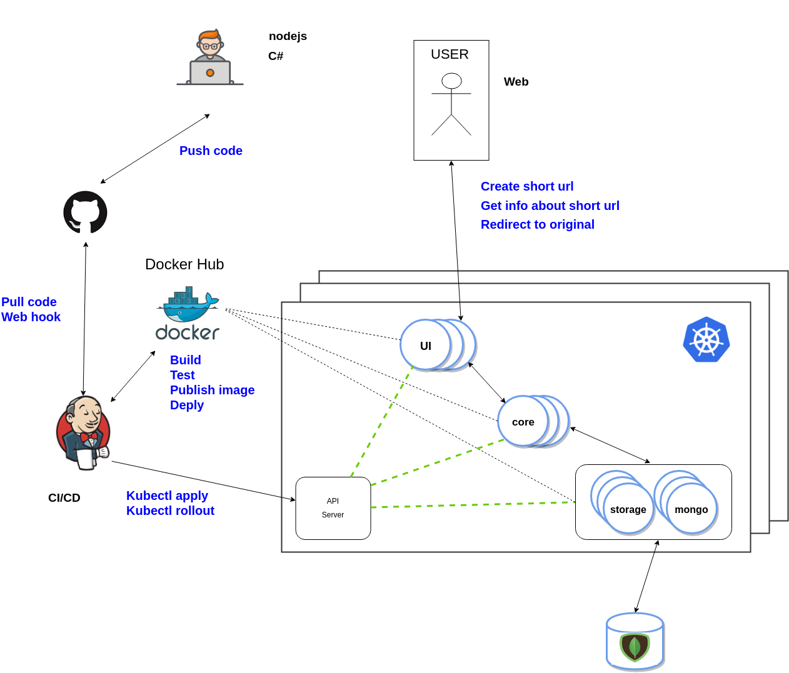

# yase
---
**Y**et **A**nother **S**hortener **E**ngine         

---

## Abstract

This project show how to develop a simple shortener service similar to [https://bit.ly/](https://bit.ly/) or [https://goo.gl/](https://goo.gl/).

This mono repository contains all the components related to the project

| Component    | Description                                                  | Refrence                         |
| ------------ | ------------------------------------------------------------ | -------------------------------- |
| yase-core      | Core engine service                                          | [README](./docs/yase-core.md)   |
| yase-storage | Storage service                                              | [README](./docs/yase-storage.md) |
| yase-ui         | Web front end                                                | [README](./docs/yase-ui.md)     |
| yase-cicd       | Jenkins pipelines to build and deploy                        | [README](./docs/yase-cicd.md)   |
| yase-tracing    | The two main services support open tracing (Jaeger)          | [README](./docs/yase-jaeger.md) |
| yase-monitoring | Prometheus integration           | [README](./docs/yase-monitoring.md) |
| yase-local      | A list of resources let you able to run all the application stack in your local environment | [README](./docs/yase-local.md)   |

## Architecture

This is the big picture of the architecture for the shortener application

The key principal that drive me during developing this project are

- scalability
- reliability
- automation
- single responsibility

To reach this goal I made some choices

- embrace **Docker** in order to build images containing all the code we are going to run. The packaged code is environment agnostic so we can build once and run everywhere.
- use **docker compose** to let the develop able to build and test the application in local environment.
- using **kubernetes** as container orchestrator allows me to have the capabilities to scale in and scale out all the services. All the services are state less.
- using a document DB like **mongodb** we are fast
- Decoupling core and storage services allows the architecture an eventually evolution, indeed we are able to change the storage service respecting the API contract. In this way we are able to remove vendor lock in over a data base and cloud provider in case to deploy the application stack on-cloud instead of on-premise
- Using docker we are able to automate all the **CI/CD** process to avoid manual actions. My vision is to have a continuous delivery process to keep the production always up to date.
- The developer should develop code keep in mind some best practice: **Clean Code**, **TDD**, functional approach.

## Improvements

**This is the MVP.**

There are some  to improve the architecture design.

- Use **REDIS** as a proximity cache of the storage service
- Use **Cassandra** instead of MongoDB as storage engine
- Improve the **Hashing** algorithm
- Multi datacenter (is quite difficult with K8s vanilla)
- Use circuit breaker to prevent cascade system failure
- Use **ISTIO** sevice mesh for the east-west communication
- Use **Prometheus** to monitor the K8s cluster
- react redux in web ui application

