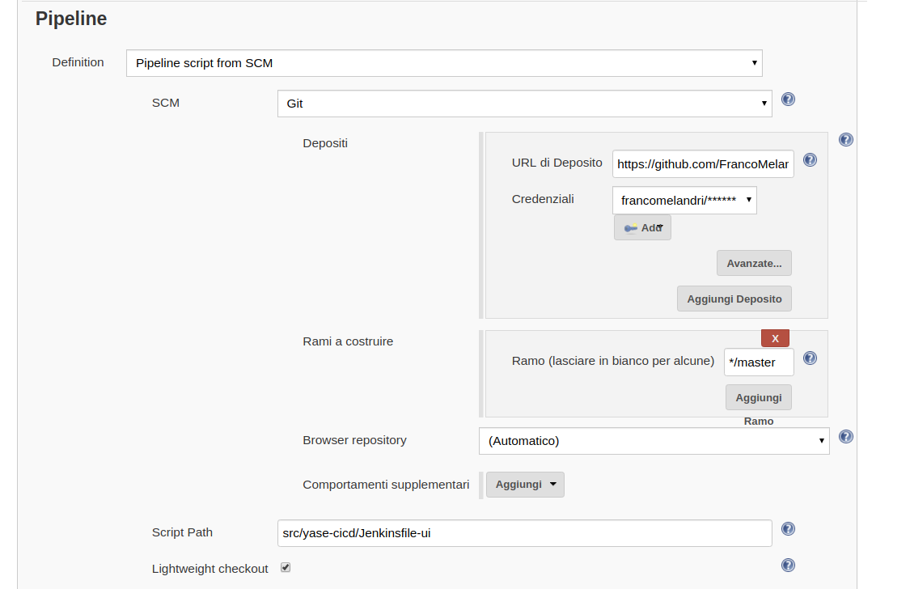

# yase CI/CD

This project contains all the pipelines code to build and deploy the services.

To test the pipelines you can run Jenkins in your local machine using **Docker** (as usual)

```bash
$ docker run --name jenkinsci -p 8080:8080 jenkins/blueocean
```


Once you have setup the **Jenkins** server without any kind of plugin, you are able to add your own Pipeline configuring in this way




In the repository you can fine one pipeline for each component belong to the application stack.

For the moment I have disable the Deploy phase leaving only the continuous integration that perform **test**, **build** and the image **publish** in docker hub. 