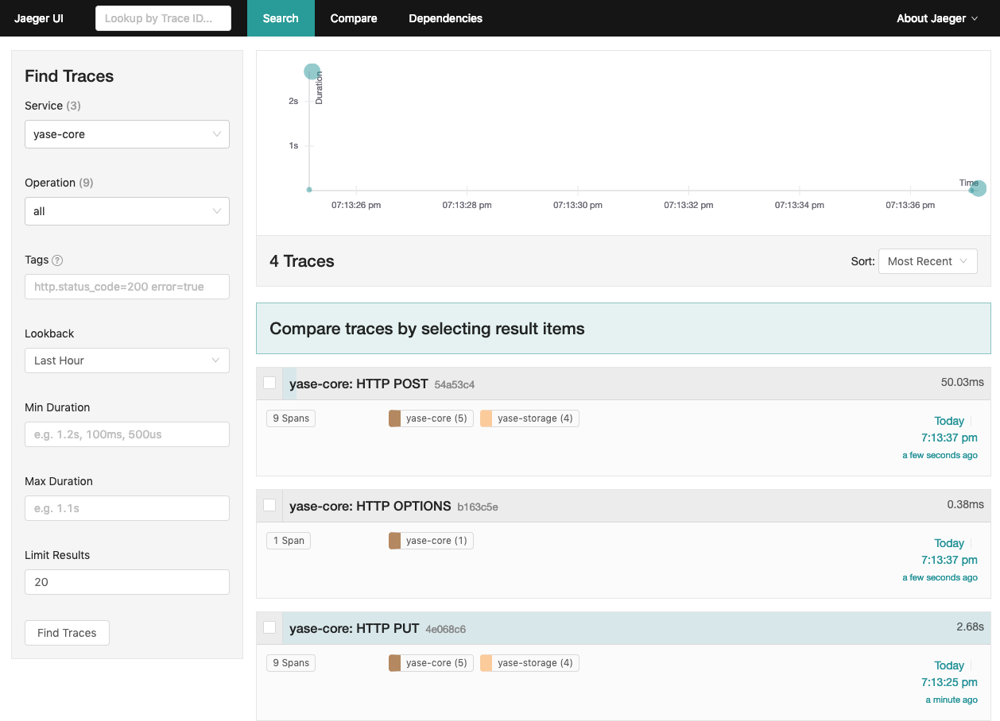
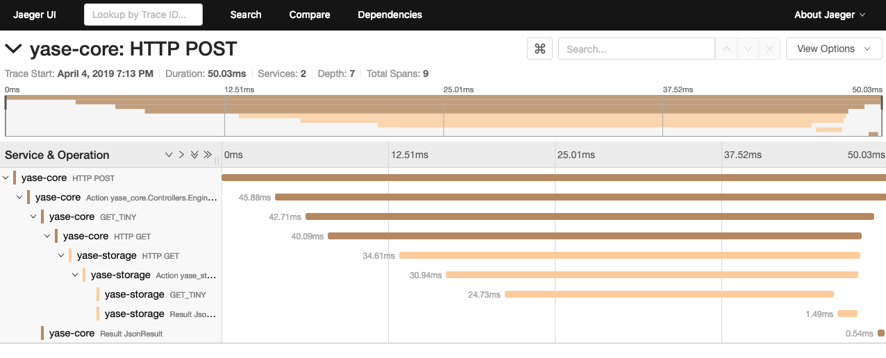

# yase-tracing

Both services, core and storage, support open tracing standard to trace and log all the requests.

In order to activate in your local machine the **jaeger** stack (<https://www.jaegertracing.io/>) you should use the command

```bash
$ docker run -d --name jaeger \
  -e COLLECTOR_ZIPKIN_HTTP_PORT=9411 \
  -p 5775:5775/udp \
  -p 6831:6831/udp \
  -p 6832:6832/udp \
  -p 5778:5778 \
  -p 16686:16686 \
  -p 14268:14268 \
  -p 9411:9411 \
  jaegertracing/all-in-one:1.8
```

and all the stuff is up and running at the address http://localhost:16686


Take a look to the dashboard




and the snap



Awesome!!