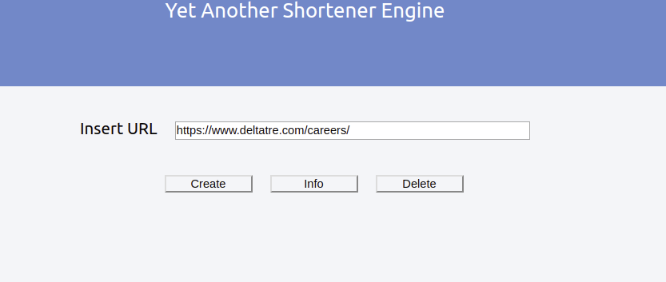
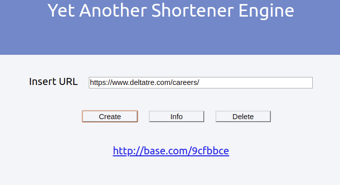

# yase-UI

React.js application (I have a lot to improve here) to interact with the core service and allow the user to **create**, **get information** and **delete** a tiny url created.

The application is very basic. It has three button allows you to perform the main actions

The **create** button allows you to create a new tiny URL

Now you can click on the URL to navigate (only if you already updated the /etc/hosts file), otherwise you can get the infor related to the tiny url, copying it in the text box and pressing Info button

At the end you can also remove the link using the delete button

